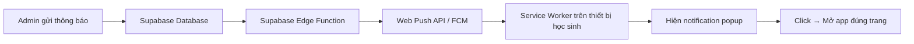

# 🔔 Web Push Notification — Implementation Plan cho PhysiVault

> **Mục tiêu**: Gửi thông báo đẩy đến điện thoại/máy tính học sinh **kể cả khi đã đóng app**, để nhắc bài mới, lịch học, thông báo admin, v.v...

---

## Tổng quan kiến trúc



**Luồng hoạt động:**
1. Học sinh mở app → browser xin quyền notification → lưu **push subscription** vào Supabase
2. Admin tạo thông báo mới → trigger Supabase Edge Function
3. Edge Function đọc danh sách subscriptions → gửi push qua Web Push Protocol
4. Service Worker trên thiết bị nhận push → hiện notification
5. Học sinh click notification → mở app đúng trang liên quan

---

## Phase 1: VAPID Keys & Service Worker (Frontend)

### 1.1 Generate VAPID Key Pair

VAPID (Voluntary Application Server Identification) là cặp key public/private dùng để xác thực server gửi push.

**Cách tạo:**
```bash
# Cài web-push CLI tool
npm install -g web-push

# Generate VAPID keys
web-push generate-vapid-keys
```

**Output sẽ như sau:**
```
Public Key:  BNbxGYNMhEIi4n...rất-dài...
Private Key: T1PaPsYFBKbNU...rất-dài...
```

**Nơi lưu:**
| Key | Lưu ở đâu | Lý do |
|-----|-----------|-------|
| **Public Key** | `VITE_VAPID_PUBLIC_KEY` trong `.env` | Frontend cần để đăng ký subscription |
| **Private Key** | Supabase Edge Function Secrets | **TUYỆT ĐỐI KHÔNG** để trong frontend code |

> [!CAUTION]
> Private key nếu lộ = ai cũng có thể gửi push notification giả mạo bạn. Chỉ lưu trong Supabase Secrets hoặc server-side.

### 1.2 Tạo Service Worker

**File**: `public/sw-push.js` (phải nằm trong `public/` để Vite copy nguyên)

```javascript
// public/sw-push.js
// Service Worker xử lý Web Push Notifications

// Nhận push message từ server
self.addEventListener('push', (event) => {
  let data = { title: 'PhysiVault', body: 'Bạn có thông báo mới!' };
  
  try {
    if (event.data) {
      data = event.data.json();
    }
  } catch (e) {
    // Fallback nếu data không phải JSON
    data.body = event.data?.text() || data.body;
  }

  const options = {
    body: data.body,
    icon: '/icon-192.svg',
    badge: '/icon-192.svg',
    tag: data.tag || 'physivault-notification',  // gom notification cùng loại
    data: {
      url: data.url || '/',                       // URL mở khi click
    },
    vibrate: [200, 100, 200],                     // rung trên mobile
    requireInteraction: false,
    actions: data.actions || [],                   // nút hành động (optional)
  };

  event.waitUntil(
    self.registration.showNotification(data.title, options)
  );
});

// Click vào notification → mở app đúng trang
self.addEventListener('notificationclick', (event) => {
  event.notification.close();

  const targetUrl = event.notification.data?.url || '/';

  event.waitUntil(
    clients.matchAll({ type: 'window', includeUncontrolled: true })
      .then((clientList) => {
        // Nếu app đang mở → focus + navigate
        for (const client of clientList) {
          if (client.url.includes(self.location.origin)) {
            client.focus();
            client.navigate(targetUrl);
            return;
          }
        }
        // Nếu app chưa mở → mở tab mới
        return clients.openWindow(targetUrl);
      })
  );
});
```

### 1.3 Tạo Push Subscription Utility

**File mới**: `src/utils/pushSubscription.ts`

```typescript
// src/utils/pushSubscription.ts

const VAPID_PUBLIC_KEY = import.meta.env.VITE_VAPID_PUBLIC_KEY || '';

/**
 * Convert VAPID key từ Base64 string sang Uint8Array
 * (Web Push API yêu cầu format này)
 */
function urlBase64ToUint8Array(base64String: string): Uint8Array {
  const padding = '='.repeat((4 - (base64String.length % 4)) % 4);
  const base64 = (base64String + padding).replace(/-/g, '+').replace(/_/g, '/');
  const rawData = window.atob(base64);
  const outputArray = new Uint8Array(rawData.length);
  for (let i = 0; i < rawData.length; ++i) {
    outputArray[i] = rawData.charCodeAt(i);
  }
  return outputArray;
}

/**
 * Đăng ký Service Worker + Push Subscription
 * Trả về PushSubscription object (chứa endpoint + keys)
 */
export async function subscribeToPush(): Promise<PushSubscription | null> {
  // 1. Check browser support
  if (!('serviceWorker' in navigator) || !('PushManager' in window)) {
    console.warn('[Push] Browser không hỗ trợ Web Push');
    return null;
  }

  // 2. Request notification permission
  const permission = await Notification.requestPermission();
  if (permission !== 'granted') {
    console.warn('[Push] User từ chối notification permission');
    return null;
  }

  // 3. Register Service Worker
  const registration = await navigator.serviceWorker.register('/sw-push.js', {
    scope: '/',
  });

  // Đợi SW active
  await navigator.serviceWorker.ready;

  // 4. Subscribe to push
  try {
    const subscription = await registration.pushManager.subscribe({
      userVisibleOnly: true,  // Bắt buộc: mỗi push phải hiện notification
      applicationServerKey: urlBase64ToUint8Array(VAPID_PUBLIC_KEY),
    });

    return subscription;
  } catch (err) {
    console.error('[Push] Subscribe failed:', err);
    return null;
  }
}

/**
 * Lấy subscription hiện tại (nếu đã đăng ký trước đó)
 */
export async function getExistingSubscription(): Promise<PushSubscription | null> {
  if (!('serviceWorker' in navigator)) return null;
  const registration = await navigator.serviceWorker.getRegistration('/');
  if (!registration) return null;
  return registration.pushManager.getSubscription();
}

/**
 * Hủy subscription (unsubscribe)
 */
export async function unsubscribeFromPush(): Promise<boolean> {
  const subscription = await getExistingSubscription();
  if (!subscription) return true;
  return subscription.unsubscribe();
}

/**
 * Chuyển PushSubscription thành JSON để lưu vào DB
 */
export function serializeSubscription(sub: PushSubscription): {
  endpoint: string;
  keys: { p256dh: string; auth: string };
} {
  const keys = sub.toJSON().keys!;
  return {
    endpoint: sub.endpoint,
    keys: {
      p256dh: keys.p256dh!,
      auth: keys.auth!,
    },
  };
}
```

---

## Phase 2: Supabase Database (Lưu Subscriptions)

### 2.1 Tạo bảng `push_subscriptions`

**Chạy SQL trong Supabase Dashboard → SQL Editor:**

```sql
-- =====================================================
-- Bảng lưu push subscription cho Web Push Notifications
-- =====================================================

CREATE TABLE IF NOT EXISTS push_subscriptions (
  id          uuid DEFAULT gen_random_uuid() PRIMARY KEY,
  student_phone text NOT NULL,
  endpoint     text NOT NULL UNIQUE,        -- URL duy nhất cho mỗi thiết bị
  p256dh       text NOT NULL,               -- Public key của client
  auth         text NOT NULL,               -- Auth secret
  created_at   timestamptz DEFAULT now(),
  updated_at   timestamptz DEFAULT now()
);

-- Index để query nhanh theo phone
CREATE INDEX idx_push_subs_phone ON push_subscriptions(student_phone);

-- RLS: chỉ cho phép đọc subscription của chính mình
ALTER TABLE push_subscriptions ENABLE ROW LEVEL SECURITY;

-- Cho phép INSERT (anonymous) — vì app dùng anon key
CREATE POLICY "Ai cũng có thể đăng ký push" ON push_subscriptions
  FOR INSERT TO anon WITH CHECK (true);

-- Cho phép DELETE subscription của mình
CREATE POLICY "User có thể hủy subscription" ON push_subscriptions
  FOR DELETE TO anon USING (true);

-- Cho phép SELECT subscription của mình  
CREATE POLICY "User có thể xem sub của mình" ON push_subscriptions
  FOR SELECT TO anon USING (true);
```

### 2.2 Tạo RPC để admin đọc tất cả subscriptions

```sql
-- RPC cho Edge Function: lấy tất cả subscriptions theo grade
-- SECURITY DEFINER → bypass RLS
CREATE OR REPLACE FUNCTION admin_get_push_subscriptions(p_grade int DEFAULT NULL)
RETURNS TABLE (
  endpoint text,
  p256dh   text,
  auth     text
) LANGUAGE plpgsql SECURITY DEFINER AS $$
BEGIN
  IF p_grade IS NULL THEN
    -- Gửi cho tất cả
    RETURN QUERY SELECT ps.endpoint, ps.p256dh, ps.auth
    FROM push_subscriptions ps;
  ELSE
    -- Gửi cho học sinh thuộc grade cụ thể
    RETURN QUERY SELECT ps.endpoint, ps.p256dh, ps.auth
    FROM push_subscriptions ps
    JOIN students s ON s.phone = ps.student_phone
    WHERE s.grade = p_grade;
  END IF;
END;
$$;
GRANT EXECUTE ON FUNCTION admin_get_push_subscriptions(int) TO anon;

-- RPC để lưu/cập nhật subscription
CREATE OR REPLACE FUNCTION upsert_push_subscription(
  p_phone    text,
  p_endpoint text,
  p_p256dh   text,
  p_auth     text
) RETURNS void LANGUAGE plpgsql SECURITY DEFINER AS $$
BEGIN
  INSERT INTO push_subscriptions (student_phone, endpoint, p256dh, auth, updated_at)
  VALUES (p_phone, p_endpoint, p_p256dh, p_p256dh)
  ON CONFLICT (endpoint) DO UPDATE SET
    student_phone = EXCLUDED.student_phone,
    p256dh        = p_p256dh,
    auth          = p_auth,
    updated_at    = now();
END;
$$;
GRANT EXECUTE ON FUNCTION upsert_push_subscription(text, text, text, text) TO anon;

-- Cleanup: xóa subscription không còn hợp lệ
CREATE OR REPLACE FUNCTION admin_remove_push_subscription(p_endpoint text)
RETURNS void LANGUAGE plpgsql SECURITY DEFINER AS $$
BEGIN
  DELETE FROM push_subscriptions WHERE endpoint = p_endpoint;
END;
$$;
GRANT EXECUTE ON FUNCTION admin_remove_push_subscription(text) TO anon;

NOTIFY pgrst, 'reload schema';
```

---

## Phase 3: Service tích hợp (Frontend → DB)

### 3.1 Push Notification Service

**File mới**: `src/services/pushNotificationService.ts`

```typescript
import { supabase } from '../lib/supabase';
import { getActivatedPhone } from '../utils/phone';
import { subscribeToPush, getExistingSubscription, 
         unsubscribeFromPush, serializeSubscription } from '../utils/pushSubscription';

/**
 * Đăng ký push notification + lưu subscription vào Supabase
 */
export async function registerPushNotification(): Promise<boolean> {
  const phone = getActivatedPhone();
  if (!phone) return false;

  // Kiểm tra xem đã subscribe chưa
  const existing = await getExistingSubscription();
  if (existing) {
    // Đã subscribe → cập nhật DB (phòng trường hợp phone đổi)
    const { endpoint, keys } = serializeSubscription(existing);
    await supabase.rpc('upsert_push_subscription', {
      p_phone: phone,
      p_endpoint: endpoint,
      p_p256dh: keys.p256dh,
      p_auth: keys.auth,
    });
    return true;
  }

  // Chưa subscribe → đăng ký mới
  const subscription = await subscribeToPush();
  if (!subscription) return false;

  const { endpoint, keys } = serializeSubscription(subscription);
  const { error } = await supabase.rpc('upsert_push_subscription', {
    p_phone: phone,
    p_endpoint: endpoint,
    p_p256dh: keys.p256dh,
    p_auth: keys.auth,
  });

  if (error) {
    console.error('[Push] Lưu subscription thất bại:', error);
    return false;
  }

  return true;
}

/**
 * Hủy đăng ký push notification
 */
export async function unregisterPushNotification(): Promise<boolean> {
  const existing = await getExistingSubscription();
  if (existing) {
    const { endpoint } = serializeSubscription(existing);
    // Xóa khỏi DB
    await supabase.rpc('admin_remove_push_subscription', {
      p_endpoint: endpoint,
    });
  }
  return unsubscribeFromPush();
}

/**
 * Kiểm tra trạng thái push
 */
export async function getPushStatus(): Promise<'subscribed' | 'unsubscribed' | 'denied' | 'unsupported'> {
  if (!('PushManager' in window)) return 'unsupported';
  if (Notification.permission === 'denied') return 'denied';
  const sub = await getExistingSubscription();
  return sub ? 'subscribed' : 'unsubscribed';
}
```

---

## Phase 4: Supabase Edge Function (Backend gửi Push)

### 4.1 Tạo Edge Function

> [!IMPORTANT]
> Edge Function là **phần quan trọng nhất** — đây là backend code chạy trên Supabase's Deno runtime, nơi giữ VAPID Private Key và thực hiện gửi push.

**Cài đặt Supabase CLI (nếu chưa có):**

```bash
npm install -g supabase
supabase login
supabase link --project-ref <your-project-ref>
```

**Tạo function:**

```bash
supabase functions new send-push-notification
```

**File**: `supabase/functions/send-push-notification/index.ts`

```typescript
// supabase/functions/send-push-notification/index.ts
import { serve } from 'https://deno.land/std@0.168.0/http/server.ts';
import { createClient } from 'https://esm.sh/@supabase/supabase-js@2';

// Web Push library cho Deno
// Dùng thư viện web-push thuần dựa trên Web Crypto API
import * as webpush from 'npm:web-push@3.6.7';

const VAPID_SUBJECT = Deno.env.get('VAPID_SUBJECT') || 'mailto:admin@physivault.com';
const VAPID_PUBLIC_KEY = Deno.env.get('VAPID_PUBLIC_KEY') || '';
const VAPID_PRIVATE_KEY = Deno.env.get('VAPID_PRIVATE_KEY') || '';
const SUPABASE_URL = Deno.env.get('SUPABASE_URL') || '';
const SUPABASE_SERVICE_ROLE_KEY = Deno.env.get('SUPABASE_SERVICE_ROLE_KEY') || '';

webpush.setVapidDetails(VAPID_SUBJECT, VAPID_PUBLIC_KEY, VAPID_PRIVATE_KEY);

interface PushPayload {
  title: string;
  body: string;
  url?: string;     // Deep link URL khi click
  tag?: string;     // Gom notification cùng loại
  grade?: number;   // Gửi cho grade cụ thể (null = tất cả)
}

serve(async (req: Request) => {
  // CORS
  if (req.method === 'OPTIONS') {
    return new Response('ok', {
      headers: {
        'Access-Control-Allow-Origin': '*',
        'Access-Control-Allow-Methods': 'POST',
        'Access-Control-Allow-Headers': 'Content-Type, Authorization',
      },
    });
  }

  try {
    const payload: PushPayload = await req.json();

    // Validate
    if (!payload.title || !payload.body) {
      return new Response(
        JSON.stringify({ error: 'title và body là bắt buộc' }),
        { status: 400, headers: { 'Content-Type': 'application/json' } }
      );
    }

    // Dùng service_role key để bypass RLS
    const supabase = createClient(SUPABASE_URL, SUPABASE_SERVICE_ROLE_KEY);

    // Lấy tất cả subscriptions
    const { data: subscriptions, error } = await supabase
      .rpc('admin_get_push_subscriptions', { p_grade: payload.grade || null });

    if (error) throw error;
    if (!subscriptions || subscriptions.length === 0) {
      return new Response(
        JSON.stringify({ message: 'Không có subscription nào', sent: 0 }),
        { headers: { 'Content-Type': 'application/json' } }
      );
    }

    // Gửi push cho từng subscription
    const pushPayload = JSON.stringify({
      title: payload.title,
      body: payload.body,
      url: payload.url || '/notifications',
      tag: payload.tag || 'physivault-' + Date.now(),
    });

    let sent = 0;
    let failed = 0;
    const failedEndpoints: string[] = [];

    await Promise.allSettled(
      subscriptions.map(async (sub: any) => {
        try {
          await webpush.sendNotification(
            {
              endpoint: sub.endpoint,
              keys: { p256dh: sub.p256dh, auth: sub.auth },
            },
            pushPayload,
            { TTL: 86400 } // notification sống tối đa 24h
          );
          sent++;
        } catch (err: any) {
          failed++;
          // Status 404 hoặc 410 = subscription expired/invalid
          if (err.statusCode === 404 || err.statusCode === 410) {
            failedEndpoints.push(sub.endpoint);
          }
        }
      })
    );

    // Cleanup expired subscriptions
    if (failedEndpoints.length > 0) {
      await Promise.allSettled(
        failedEndpoints.map((endpoint) =>
          supabase.rpc('admin_remove_push_subscription', { p_endpoint: endpoint })
        )
      );
    }

    return new Response(
      JSON.stringify({
        message: `Đã gửi push notifications`,
        sent,
        failed,
        cleaned: failedEndpoints.length,
      }),
      { headers: { 'Content-Type': 'application/json' } }
    );
  } catch (err: any) {
    return new Response(
      JSON.stringify({ error: err.message }),
      { status: 500, headers: { 'Content-Type': 'application/json' } }
    );
  }
});
```

### 4.2 Deploy Edge Function + Set Secrets

```bash
# Set secrets (VAPID Private Key + Service Role Key)
supabase secrets set VAPID_SUBJECT="mailto:admin@physivault.com"
supabase secrets set VAPID_PUBLIC_KEY="BNbxGYNMh..."    # Public key đã generate
supabase secrets set VAPID_PRIVATE_KEY="T1PaPsYFB..."   # Private key — BÍ MẬT
# SUPABASE_URL và SUPABASE_SERVICE_ROLE_KEY có sẵn trong Supabase Edge Functions

# Deploy
supabase functions deploy send-push-notification --no-verify-jwt
```

> [!WARNING]
> `--no-verify-jwt` cho phép gọi function không cần JWT. Trong production, bạn nên thêm API key hoặc admin token check bên trong function.

---

## Phase 5: Tích hợp vào UI

### 5.1 Auto-register khi đăng nhập/kích hoạt

Trong `App.tsx` hoặc `useCloudStorage.ts`, sau khi kích hoạt thành công:

```typescript
// Trong activateSystem() hoặc useEffect khi isActivated = true
import { registerPushNotification } from './services/pushNotificationService';

// Gọi 1 lần khi user kích hoạt thành công
useEffect(() => {
  if (isActivated) {
    registerPushNotification().then(ok => {
      if (ok) console.log('[Push] Đã đăng ký push notifications');
    });
  }
}, [isActivated]);
```

### 5.2 Toggle On/Off trong Settings

Thêm ON/OFF switch vào `SettingsModal.tsx`:

```tsx
// Trong SettingsModal
const [pushStatus, setPushStatus] = useState<string>('checking');

useEffect(() => {
  getPushStatus().then(setPushStatus);
}, []);

// UI
<div>
  <label>Thông báo đẩy</label>
  {pushStatus === 'subscribed' && (
    <button onClick={async () => {
      await unregisterPushNotification();
      setPushStatus('unsubscribed');
    }}>Tắt thông báo</button>
  )}
  {pushStatus === 'unsubscribed' && (
    <button onClick={async () => {
      const ok = await registerPushNotification();
      setPushStatus(ok ? 'subscribed' : 'denied');
    }}>Bật thông báo</button>
  )}
  {pushStatus === 'denied' && (
    <span>⚠️ Đã bị chặn — vào Settings trình duyệt để bật lại</span>
  )}
  {pushStatus === 'unsupported' && (
    <span>Trình duyệt không hỗ trợ</span>
  )}
</div>
```

### 5.3 Admin gửi Push từ NotificationPage

Sửa `NotificationPage.tsx` — thêm nút "Gửi Push" khi tạo thông báo:

```typescript
// Gọi Edge Function
const sendPushToAll = async (title: string, body: string, grade?: number) => {
  const supabaseUrl = import.meta.env.VITE_SUPABASE_URL;
  const response = await fetch(
    `${supabaseUrl}/functions/v1/send-push-notification`,
    {
      method: 'POST',
      headers: { 'Content-Type': 'application/json' },
      body: JSON.stringify({ title, body, grade, url: '/notifications' }),
    }
  );
  return response.json();
};

// Trong handleSendNotification:
const handleSendNotification = async () => {
  // 1. Tạo in-app notification (như cũ)
  await onCreateNotification(composeMessage, composeGrade);
  
  // 2. Gửi push notification
  const result = await sendPushToAll(
    '📢 Thông báo mới từ PhysiVault',
    composeMessage,
    composeAllGrades ? undefined : composeGrade
  );
  
  onShowToast(`Đã gửi push cho ${result.sent} thiết bị`, 'success');
};
```

### 5.4 Auto push khi có bài mới (fetchLessonsFromCloud)

Trong `useCloudStorage.ts`, sau khi admin fetch lesson mới thành công, gọi Edge Function:

```typescript
// Sau khi fetchLessonsFromCloud thành công
if (result.success && result.lessonCount > 0) {
  // Gửi push
  await fetch(`${supabaseUrl}/functions/v1/send-push-notification`, {
    method: 'POST',
    headers: { 'Content-Type': 'application/json' },
    body: JSON.stringify({
      title: '📚 Bài học mới!',
      body: `Có ${result.lessonCount} bài học mới đã được cập nhật. Mở app để xem ngay!`,
      grade: grade,
      url: `/grade/${grade}`,
    }),
  });
}
```

---

## Phase 6: Tích hợp với Schedule Reminders

### 6.1 Edge Function nhắc lịch theo cron

Tạo thêm 1 Edge Function chạy theo schedule (cron job):

**File**: `supabase/functions/schedule-push-reminder/index.ts`

```typescript
// Chạy mỗi 5 phút bằng Supabase Cron
// Kiểm tra schedule nào sắp bắt đầu trong 5 phút tới → gửi push

serve(async () => {
  const supabase = createClient(SUPABASE_URL, SUPABASE_SERVICE_ROLE_KEY);
  
  const now = new Date();
  const fiveMinLater = new Date(now.getTime() + 5 * 60 * 1000);
  const todayStr = now.toISOString().slice(0, 10);
  const nowTime = now.toTimeString().slice(0, 5);
  const laterTime = fiveMinLater.toTimeString().slice(0, 5);

  // Lấy schedule sắp bắt đầu
  const { data: upcomingSchedules } = await supabase
    .from('schedules')
    .select('*')
    .eq('date', todayStr)
    .gte('start_time', nowTime)
    .lte('start_time', laterTime);

  if (!upcomingSchedules?.length) {
    return new Response(JSON.stringify({ message: 'Không có lịch sắp tới' }));
  }

  // Gửi push cho mỗi schedule
  for (const schedule of upcomingSchedules) {
    await sendPush({
      title: '📚 Sắp đến giờ học!',
      body: `${schedule.title} — ${schedule.start_time}`,
      grade: schedule.grade,
      url: '/planner',
      tag: `schedule-${schedule.id}`,
    });
  }

  return new Response(JSON.stringify({ sent: upcomingSchedules.length }));
});
```

**Setup cron job trong Supabase Dashboard:**
- Vào **Database → Extensions** → bật `pg_cron`
- SQL:
```sql
SELECT cron.schedule(
  'push-schedule-reminder',
  '*/5 * * * *',  -- Mỗi 5 phút
  $$
  SELECT net.http_post(
    url := '<SUPABASE_URL>/functions/v1/schedule-push-reminder',
    headers := '{"Authorization": "Bearer <SERVICE_ROLE_KEY>"}'::jsonb,
    body := '{}'::jsonb
  ) AS request_id;
  $$
);
```

---

## Checklist triển khai theo thứ tự

### Giai đoạn 1 — Backend & Infrastructure (ưu tiên cao)
- [ ] Generate VAPID key pair
- [ ] Lưu `VITE_VAPID_PUBLIC_KEY` vào `.env` và Vercel env vars
- [ ] Chạy SQL tạo bảng `push_subscriptions` + RPCs
- [ ] Test: kiểm tra bảng + RPCs hoạt động

### Giai đoạn 2 — Service Worker & Frontend Utils
- [ ] Tạo `public/sw-push.js`
- [ ] Tạo `src/utils/pushSubscription.ts`
- [ ] Tạo `src/services/pushNotificationService.ts`
- [ ] Cập nhật `manifest.json` nếu cần (nếu dùng manifest SW)
- [ ] Test: đăng ký subscription, kiểm tra console + DB

### Giai đoạn 3 — Edge Function Deploy
- [ ] Cài Supabase CLI & link project
- [ ] Tạo + deploy `send-push-notification` Edge Function
- [ ] Set secrets (VAPID private key, service role key)
- [ ] Test: gọi Edge Function bằng curl/Postman → kiểm tra nhận push

### Giai đoạn 4 — UI Integration
- [ ] Auto-register push khi kích hoạt (`App.tsx`)
- [ ] Toggle push on/off trong `SettingsModal.tsx`
- [ ] Admin gửi push từ `NotificationPage.tsx`
- [ ] Push khi có bài mới (`useCloudStorage.ts`)
- [ ] Test end-to-end: admin gửi → học sinh nhận

### Giai đoạn 5 — Schedule Reminders (bonus)
- [ ] Tạo + deploy `schedule-push-reminder` Edge Function
- [ ] Setup pg_cron job
- [ ] Test: tạo schedule → đợi 5 phút → nhận push

---

## Lưu ý quan trọng

> [!WARNING]
> ### Các "gotcha" thường gặp:
> 1. **iOS Safari** chỉ hỗ trợ Web Push từ **iOS 16.4+** VÀ app phải được **Add to Home Screen** mới nhận được push
> 2. **Permission chỉ hỏi 1 lần** — nếu user chọn "Block", phải vào Settings trình duyệt mới bật lại được
> 3. **Subscription expiry** — subscription endpoint có thể hết hạn bất cứ lúc nào, cần cleanup thường xuyên (đã xử lý trong Edge Function)
> 4. **HTTPS bắt buộc** — Service Worker + Push API chỉ hoạt động trên HTTPS (localhost OK cho dev)
> 5. **Vercel deploy** — file `public/sw-push.js` phải được serve ở root `/sw-push.js`, kiểm tra Vercel có tự xử lý không

> [!TIP]
> ### Ước tính thời gian:
> | Giai đoạn | Thời gian |
> |-----------|-----------|
> | Phase 1: VAPID + SW | ~30 phút |
> | Phase 2: DB Schema | ~15 phút |
> | Phase 3: Frontend Service | ~45 phút |
> | Phase 4: Edge Function | ~1-2 giờ |
> | Phase 5: UI Integration | ~1-2 giờ |
> | Phase 6: Schedule Cron | ~1 giờ |
> | Testing + Debug | ~1-2 giờ |
> | **Tổng cộng** | **~5-8 giờ** |

---

## Files cần tạo/sửa (tổng kết)

| Action | File | Mô tả |
|--------|------|-------|
| ✨ Tạo mới | `public/sw-push.js` | Service Worker xử lý push |
| ✨ Tạo mới | `src/utils/pushSubscription.ts` | Utility đăng ký push subscription |
| ✨ Tạo mới | `src/services/pushNotificationService.ts` | Service tích hợp push + DB |
| ✨ Tạo mới | `supabase/functions/send-push-notification/index.ts` | Edge Function gửi push |
| ✨ Tạo mới | `supabase/functions/schedule-push-reminder/index.ts` | Cron nhắc lịch học |
| 📝 Sửa | `App.tsx` | Auto-register push khi activated |
| 📝 Sửa | `components/SettingsModal.tsx` | Toggle push on/off |
| 📝 Sửa | `components/NotificationPage.tsx` | Admin gửi push |
| 📝 Sửa | `src/hooks/useCloudStorage.ts` | Push khi có bài mới |
| 📝 Sửa | `.env` | Thêm `VITE_VAPID_PUBLIC_KEY` |
| 🗃️ SQL | Supabase dashboard | Tạo bảng + RPCs |
